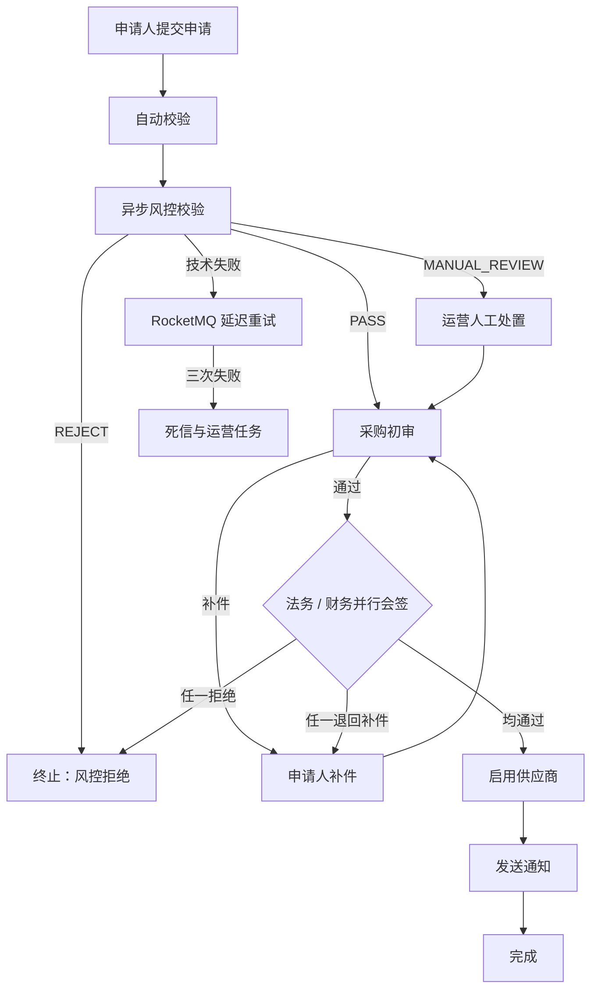

# FlowMesh（流织）正式设计蓝图

> 状态：已确认，待实施
> 更新日期：2026-08-13
> 许可证：Apache-2.0

## 1. 定位与范围

**FlowMesh** 是一个面向多租户 B2B SaaS 的云原生供应商准入与采购合同审批平台。它以 Java 21、Spring Boot、Camunda 8 与 Apache RocketMQ 为核心，重点证明跨服务长流程、可靠消息、失败恢复、审计追踪和 Kubernetes 工程化能力。

首版不是通用 OA 或流程设计器。它只实现一个可完整演示的供应商准入流程，并提供四组可复现的可靠性验证剧本。

### 首版目标

- 供应商申请、材料提交、外部风控、采购初审、法务/财务并行会签、启用与通知。
- 可靠消息：Transactional Outbox、持久化幂等、延迟重试、死信、人工重放和事件对账。
- 共享库多租户：应用层自动注入租户条件 + PostgreSQL RLS 最终防线。
- 本地 Docker Compose 一键运行；kind + Helm 验证云原生部署。
- 指标、日志、Trace、告警、压测、CI 质量与安全门禁。

### 明确不做

- 通用拖拽流程设计器、真实第三方征信、真实邮件/短信、支付。
- 复杂组织树、流程实例迁移、RocketMQ 高可用集群、完整跨集群灾备。
- Argo CD 与 Chaos Mesh；作为后续演进项。

## 2. 业务流程

### 角色

| 角色 | 职责 |
| --- | --- |
| 申请人 | 创建申请、上传材料、补件 |
| 采购专员 | 资料初审 |
| 法务 | 合同与合规会签 |
| 财务 | 结算资质会签 |
| 风控服务 | 模拟外部风险结果 |
| `OPERATIONS` | 平台级重放、对账修复、人工覆盖与流程终止 |

### BPMN 主链



### 业务状态机

```text
DRAFT → SUBMITTED → RISK_CHECKING → PROCUREMENT_REVIEW
  → PARALLEL_REVIEW → ACTIVATING → ENABLED
                     ↘ PENDING_SUPPLEMENT → PROCUREMENT_REVIEW
  → REJECTED / TERMINATED
```

- 申请状态仅由 `supplier-service` 的受控命令转换，并维护 `stateVersion`。
- 补件最多两次；超过次数进入 `TERMINATED`。
- 所有历史审批意见保留快照，补件不能覆盖历史记录。
- 审批 SLA 为 24 小时：第 20 小时催办，24 小时转 `OPERATIONS`，由 Camunda Timer 实现。

## 3. 服务边界

| 服务 | 职责 | 数据归属 / Worker |
| --- | --- | --- |
| `gateway-service` | 认证入口、限流、路由、受信租户上下文透传 | 无业务数据 |
| `iam-service` | 用户、角色、组织、JWT / Refresh Token | IAM Schema |
| `supplier-service` | 申请、材料元数据、供应商主数据、状态机、审批快照、Outbox | Supplier Schema；启用供应商 Worker |
| `workflow-service` | BPMN 部署、流程发起、Camunda 任务查询与完成、流程查询 | Workflow Schema；Camunda Client |
| `risk-service` | 模拟风险校验、异步回调与受控故障注入 | Risk Schema；风险校验 Worker |
| `notification-audit-service` | 通知、审计查询、DLQ 重放、事件对账 | Audit Schema；通知 Worker |

每个服务使用独立 PostgreSQL Schema 和独立数据库账号，并各自通过 Flyway 迁移。禁止跨服务直查表；同步调用统一 REST/JSON + OpenAPI，异步交互使用 RocketMQ。

## 4. 状态真相源与跨系统恢复

- `supplier-service` 是申请、供应商状态与审批快照的业务权威。
- Camunda 是节点、用户任务、定时器及流程推进的编排权威。
- 两者用 `applicationId + processInstanceKey` 关联，并由每 5 分钟对账任务检测差异。
- Electron 桌面工作台经 `workflow-service` 查询和完成 Camunda User Task；Tasklist 仅供运维与演示观察，不维护第二套待办状态。

### 跨系统动作

| 场景 | 处理方案 |
| --- | --- |
| 申请已落库但流程尚未启动 | 同一事务写入 `START_PROCESS` Outbox；`workflow-service` 幂等消费并启动流程，回写 `processInstanceKey` |
| Outbox 发布 | 收到 RocketMQ Broker 发送成功 ACK 才标记投递完成；记录 `brokerMessageId`、时间和尝试次数 |
| 审批动作部分成功 | 使用持久化 `approvalCommandId`：先锁定任务并写 `PENDING` 记录，再可重试地完成 Camunda 任务与审批快照；对账恢复卡住记录 |
| 对账差异 | 仅自动修复确定性的“已提交 Outbox 未投递”；审批结论和供应商状态一律创建 `OPERATIONS` 任务人工处理 |

## 5. RocketMQ 与可靠性

### Topic

| Topic | 示例 Tag |
| --- | --- |
| `supplier-events` | `ApplicationSubmitted`、`SupplierActivated`、`SupplementRequested` |
| `risk-events` | `RiskCheckRequested`、`RiskCheckCompleted`、`RiskCheckFailed` |
| `notification-events` | `SupplierActivationNotificationRequested` |
| `audit-events` | `AuditRecorded`、`ReplayRequested` |

统一 JSON 事件信封：

```json
{
  "eventId": "uuid",
  "eventType": "SupplierActivated",
  "schemaVersion": 1,
  "tenantId": "tenant-a",
  "aggregateId": "application-id",
  "occurredAt": "2026-08-13T10:00:00Z",
  "traceId": "trace-id",
  "payload": {}
}
```

事件仅新增字段；破坏性修改使用新事件类型或新版本消费者。REST API 统一以 `/api/v1` 起步，破坏性修改开 `/v2`。

### 投递与消费规则

- 生产主线使用 **Transactional Outbox**；业务写入、审计、Outbox 在同一数据库事务提交。
- 所有 HTTP 重试、Camunda Worker、RocketMQ 消费和人工重放以 `commandId/eventId + handlerType` 做持久化幂等。
- 幂等记录保存处理状态、尝试次数、结果摘要、Trace 与关联原始事件；成功后再确认 Job/消息。
- 风控技术失败按 1 分钟、5 分钟、15 分钟延迟重试；三次失败后进入 DLQ 并创建运营任务。
- 重放生成新 `eventId`，同时保留 `originalEventId` 和完整重放链路。

### RocketMQ 事务消息对照实验

主链不叠加事务消息。实验链仅在实验环境发布 `SupplierActivationAuditRecorded`：验证 Half Message、本地事务回查与最终可见性，消费者只写独立实验审计表，不触发真实供应商状态或通知。

## 6. 安全、多租户与文件

### 身份与授权

- Spring Security + 自签发 JWT + RBAC。
- Access Token：15 分钟；Refresh Token：7 天，数据库仅保存哈希，支持轮换与撤销。
- `tenant_id` 写入已签名 JWT claim，由网关提取并向内网服务透传；下游仍校验令牌/可信网关上下文。
- `OPERATIONS` 为平台角色。死信重放、人工风控覆盖、流程终止与对账修复都需二次确认、填写原因、记录前后状态。

### 数据隔离

- Hibernate Filter/MyBatis 拦截器自动注入 `tenant_id`。
- PostgreSQL RLS 是最终防线；业务事务设置当前租户。迁移与受限管理账号不得用于业务连接。
- 任何 API 或消息消费者越权均拒绝执行并记录审计。

### 文件

- MinIO 私有桶，路径为 `tenantId/applicationId/fileId`。
- 后端签发短时预签名 URL，并校验租户、申请状态、类型和大小。
- 首版仅 PDF/PNG/JPG，单文件最大 10 MB；预留病毒扫描事件。

## 7. 数据生命周期

| 数据 | 默认保留期 |
| --- | --- |
| 审批快照、审计日志 | 5 年 |
| 软删除申请、供应商数据 | 1 年后清理 |
| Outbox、消费幂等、重放记录 | 90 天 |
| DLQ | 30 天 |
| MinIO 逻辑删除对象 | 7 天 |

审批快照、审计、Outbox 与消费记录仅追加、不可修改。所有时刻以 UTC 持久化；UI 默认按 `Asia/Shanghai` 展示，触发器按实际发生时间记录。

## 8. 可观测性、告警与故障注入

- Metrics：Prometheus + Grafana。
- Trace：OpenTelemetry + Tempo 或 Jaeger。
- Logs：Loki；统一携带 `traceId`、`tenantId`、`applicationId`、`eventId`。
- 必须告警：服务不可用、5xx、RocketMQ 消费失败、Outbox 堆积、DLQ 非空、对账差异、审批超 SLA。
- `risk-service` 的 `OPERATIONS` 受控故障开关支持超时、500、重复回调、固定业务拒绝；默认关闭、自动过期并写审计。

## 9. 部署与工程基线

### 9.0 当前实现边界

本设计蓝图包含后续演进目标。当前可运行 MVP 仅提供 PostgreSQL、RocketMQ、IAM、supplier、workflow、Vue 3 和 Electron；Camunda、Redis、MinIO、风险服务、通知审计服务、Prometheus/Grafana、OpenTelemetry、对账和人工重放入口尚未接入运行链路。部署和面试说明必须以 README 的能力边界表为准。

### 技术栈

```text
Java 21 LTS · Spring Boot 3.x · Maven Wrapper
Camunda 8 · Apache RocketMQ · PostgreSQL · Redis · MinIO
Electron · Vue 3 · TypeScript · Vite
Docker Compose · kind · Helm · GitHub Actions
Prometheus · Grafana · OpenTelemetry · Loki
```

### 运行方式

- Docker Compose：本地开发与四个剧本复现。
- kind + Helm：唯一维护的 Kubernetes 演示运行时。
- Camunda 使用最小单副本自托管拓扑：Zeebe、Operate、Tasklist、Identity。
- RocketMQ 演示使用单 Broker。生产建议多 Broker/多副本、持久卷、监控与故障域；演示环境不承诺基础设施高可用或灾备。
- 仅 Gateway 对外暴露，其他服务和中间件均为内网；调试用 Compose 端口或 `kubectl port-forward`。

### Kubernetes 默认安全配置

- `resources.requests/limits` 与 startup/readiness/liveness probe。
- 非 root、只读根文件系统、禁用特权提升。
- Secret 通过环境变量或挂载注入，绝不进入镜像。
- NetworkPolicy 默认拒绝，仅放通必需链路；README 说明 CNI 是否实际执行策略。

### 配置、备份与 CI

- 本地：Git 忽略的 `.env`；仓库提交 `.env.example`。
- Kubernetes：Secret 模板；CI：GitHub Actions Secrets。
- PostgreSQL、MinIO 与关键配置提供备份/恢复脚本，并执行一次本地恢复演练。
- PR：构建、单测、Testcontainers 集成测试、镜像构建、Maven Enforcer、格式、依赖漏洞检查与许可证头检查。
- `main`：推送 GHCR、Helm lint/template，并可手动部署到 kind。

## 10. 测试与验收

### 测试梯度

1. 单元测试：状态机、权限、幂等与重试。
2. Testcontainers：PostgreSQL、Redis、RocketMQ。
3. API/事件契约测试：包括向后兼容字段新增。
4. E2E：正常、补件、风控故障、重复消息、DLQ 重放、Outbox 延迟、跨租户越权。
5. 压测：申请创建与风控事件消费。

### 量化指标

- 创建申请：按租户限流 20 req/min；本机 p95 < 300 ms（仅参考）。
- 登录：按 IP 限流 10 req/min。
- 无故障风控事件端到端 p95 < 5 秒。
- 故障恢复后不得重复审批、重复启用或泄露跨租户数据。

### README 必须可复现的剧本

1. 正常准入：采购初审 → 法务/财务并行会签 → 启用 → 通知。
2. 补件：法务退回 → 上传材料 → 重新初审 → 启用。
3. 风控故障：连续超时 → 延迟重试 → DLQ → 运营重放或人工处置。
4. 可靠性与隔离：重复事件、Outbox 延迟、跨租户越权，不产生重复启用或数据泄露。

## 11. 实施路线

按可演示纵切分推进，每一步均可运行、测试和回归：

1. 工程骨架、双租户种子数据、认证、RLS、申请创建与请求幂等。
2. BPMN、流程启动 Outbox、采购审批、Vue 申请与待办页。
3. 风控 Worker、延迟重试、故障注入、人工处置。
4. 并行会签、补件、供应商启用、通知与审计。
5. Outbox Publisher、消费幂等、DLQ、重放、对账与事务消息实验。
6. 可观测性、压测、Compose、kind/Helm、GitHub Actions、安全门禁与恢复演练。

## 12. 仓库交付清单

```text
后端 Maven 多模块服务
frontend/                 # Vue 3 最小任务中心
infra/compose/            # 本地运行
infra/helm/               # kind 部署
docs/                     # 架构、BPMN、状态机、事件、ADR、运行手册
tests/                    # REST Client、E2E、压测、契约测试
dashboards/               # Grafana Dashboard JSON
scripts/                  # 初始化、备份、恢复、剧本辅助脚本
```

最终交付包含架构图、BPMN 图、状态机图、事件/Topic/Tag 清单、OpenAPI、REST Client、测试与压测脚本、故障注入说明、运行手册、ADR、Grafana Dashboard 和查询示例。

## 13. 关键风险与约束

- 单 Broker 与单副本 Camunda 仅验证应用层可靠性，不能证明基础设施高可用。
- RocketMQ 事务消息不保证下游业务恰好一次；所有下游处理仍必须幂等。
- Redis 是可丢失派生层，绝不能作为审批、锁或幂等的唯一事实来源。
- Camunda、业务库和 RocketMQ 不共享全局事务；全部跨系统动作均须可重试、可审计、可对账。
- 预签名 URL 会在有效期内暴露给持有者，必须保持私有桶和短有效期。
