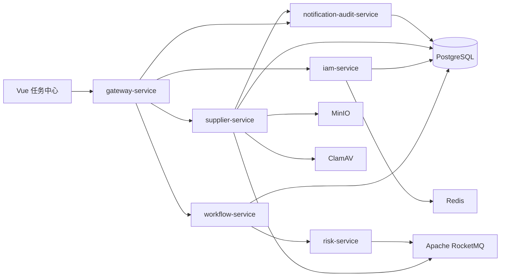

# 架构说明

## 架构目标

FlowMesh 使用 API 网关、领域服务、流程编排和事件通信分离供应商准入业务。同步 REST 调用只用于需要立即得到结果的命令或查询；长流程和跨服务副作用通过 RocketMQ 事件驱动。当前流程推进由 `workflow-service` 内部状态机负责，后续可在不改变事件契约的前提下接入 Camunda。

## 服务关系

## 服务边界

| 服务 | 对外职责 | 不负责的内容 |
| --- | --- | --- |
| `gateway-service` | 统一 API 路由、下游超时和入口收敛 | JWT、业务状态维护 |
| `iam-service` | 用户、角色、Token 与会话 | 供应商审批 |
| `supplier-service` | 申请、供应商状态机、材料元数据、审批快照和对象存储授权 | 流程节点推进 |
| `workflow-service` | 消费申请提交事件、保存流程实例和持久化待办任务、推进并行审批并发布结果事件 | 供应商主数据 |
| `risk-service` | 消费风控请求，持久化风控结论并发布结果事件 | 当前使用可复现的模拟规则，不代表接入真实征信机构 |
| `notification-audit-service` | 消费供应商启用事件，写入通知和不可变审计投影，提供通知查询和已读操作 | 外部邮件、短信或企业 IM 通道 |

## 数据与网络边界

- 每个服务拥有独立 PostgreSQL Schema、数据库账号和 Flyway 迁移历史。
- 服务不得跨 Schema 查询或修改业务表。跨服务数据通过 REST、事件或只读投影获得。
- 仅 Gateway 应对外暴露。业务服务、RocketMQ、PostgreSQL、Redis 和 MinIO 仅在内网可访问；Gateway 通过 `/api/{service}/**` 路由到下游并移除入口前缀。未来启用 Camunda 时，Camunda 同样只允许内网访问。
- `tenant_id` 必须贯穿 JWT、REST 上下文、事件信封和数据表；未来启用 Camunda 时再映射到流程变量。

## 可靠性边界

- 申请和供应商状态以 `supplier-service` 为业务权威来源。
- 当前流程节点、用户任务和定时器以 `workflow-service` 的持久化状态为编排权威来源；未来接入 Camunda 后才切换为外部流程引擎权威。
- `workflow_instances.current_task` 是兼容旧客户端的流程摘要；可执行任务和审批历史以 `workflow_tasks` 为准。
  采购初审完成后创建法务、财务两个独立待办，两个任务均完成后才创建运营启用任务。
- 当前通过 `applicationId + workflowInstanceId` 关联；对账任务检查 Supplier 与 Workflow 的投影差异。
- Outbox 仅在收到 RocketMQ Broker ACK 后标记投递完成；消费者以持久化幂等记录保证至少一次投递下的业务正确性。
