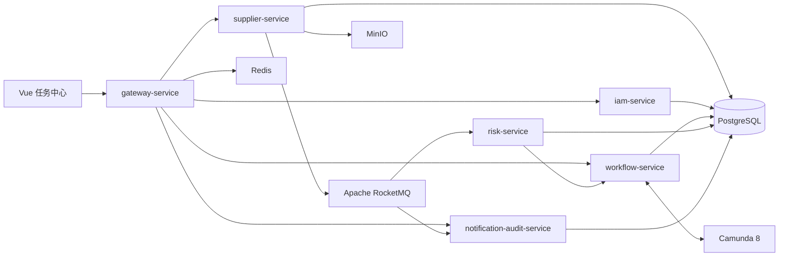

# 架构说明

## 架构目标

FlowMesh 使用领域服务、流程编排和事件通信分离供应商准入业务。同步 REST 调用只用于需要立即得到结果的命令或查询；长流程和跨服务副作用通过 Camunda Job 与 RocketMQ 事件驱动。

## 服务关系

## 服务边界

| 服务 | 对外职责 | 不负责的内容 |
| --- | --- | --- |
| `gateway-service` | 认证入口、路由、限流、受信上下文透传 | 业务状态维护 |
| `iam-service` | 用户、角色、Token 与会话 | 供应商审批 |
| `supplier-service` | 申请、供应商状态机、材料元数据、审批快照 | BPMN 节点推进 |
| `workflow-service` | 消费申请提交事件、保存流程实例投影、发布审批完成事件；后续承载 BPMN 和用户任务 | 供应商主数据 |
| `risk-service` | 模拟风险结果与受控故障 | 审批决策 |
| `notification-audit-service` | 通知、审计查询、DLQ 重放、对账 | 供应商状态变更 |

## 数据与网络边界

- 每个服务拥有独立 PostgreSQL Schema、数据库账号和 Flyway 迁移历史。
- 服务不得跨 Schema 查询或修改业务表。跨服务数据通过 REST、事件或只读投影获得。
- 仅 Gateway 对外暴露。业务服务、Camunda、RocketMQ、PostgreSQL、Redis 和 MinIO 仅在内网可访问。
- `tenant_id` 必须贯穿 JWT、REST 上下文、Camunda 流程变量、事件信封和数据表。

## 可靠性边界

- 申请和供应商状态以 `supplier-service` 为业务权威来源。
- 流程节点、用户任务和定时器以 Camunda 为编排权威来源。
- 两侧通过 `applicationId + processInstanceKey` 关联；对账任务每 5 分钟检查差异。
- Outbox 仅在收到 RocketMQ Broker ACK 后标记投递完成；消费者以持久化幂等记录保证至少一次投递下的业务正确性。
